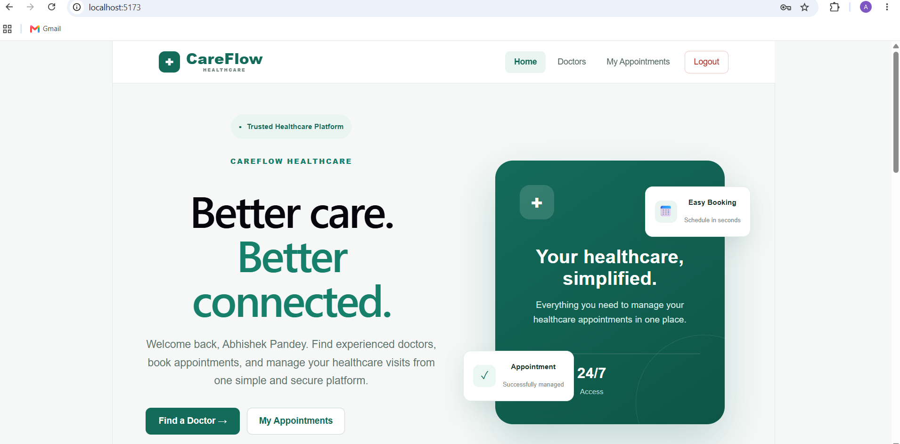
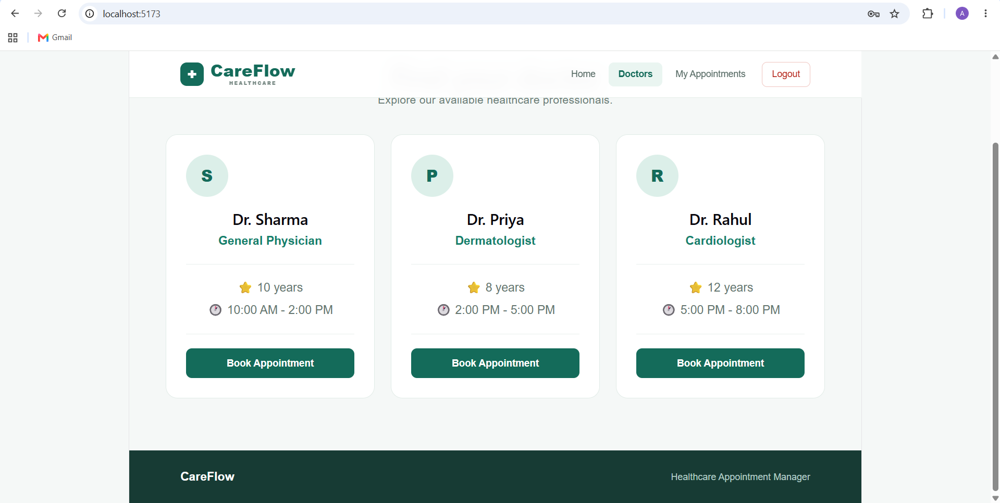
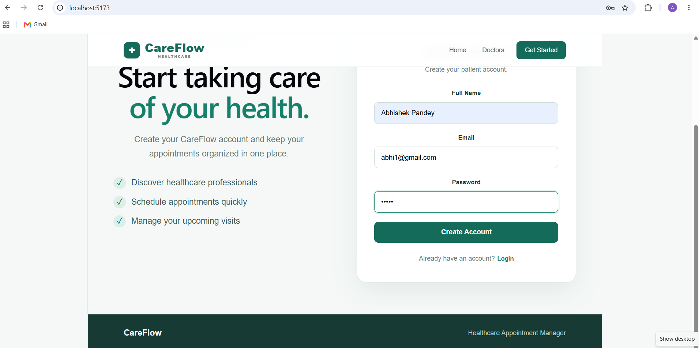
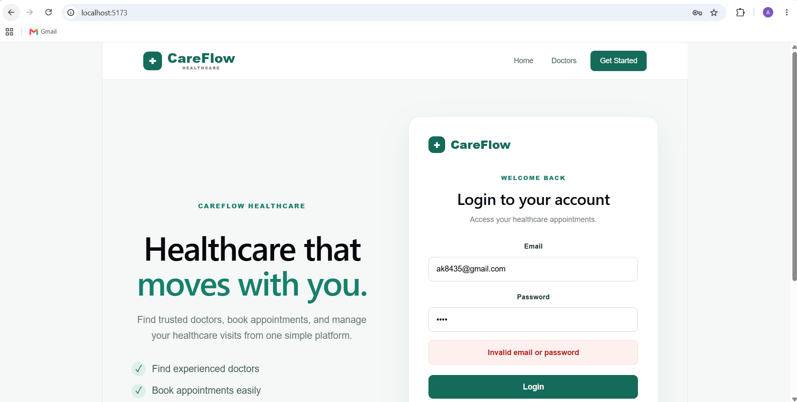
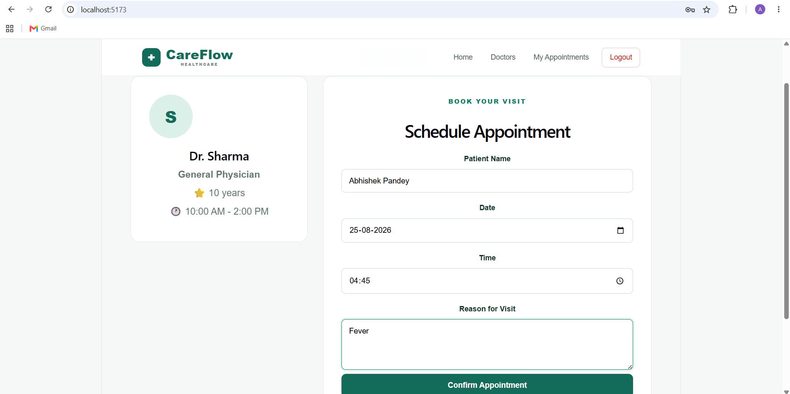
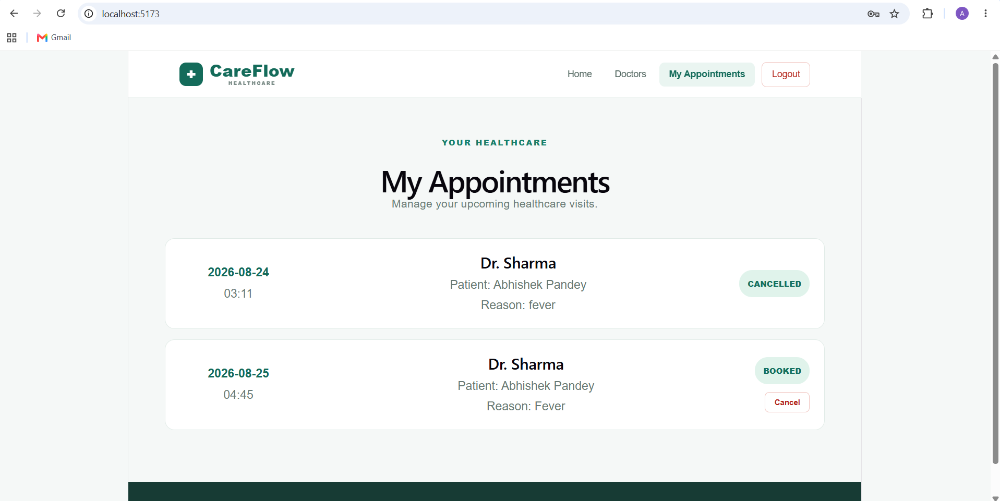

# 🏥 CareFlow

### Healthcare Appointment Management Platform

<p align="center">
  <strong>Find doctors. Book appointments. Manage your healthcare.</strong>
</p>

<p align="center">
  A full-stack healthcare appointment management system built with React, Spring Boot and MySQL.
</p>

<p align="center">
  
  
  
  
  
</p>

---

## 🌟 Overview

**CareFlow** is a full-stack healthcare appointment management platform designed to make the process of finding doctors and managing appointments simple and organized.

Patients can browse available doctors without logging in, create an account, securely log in, book appointments, view their scheduled visits and cancel upcoming appointments.

The project demonstrates complete **frontend-to-backend integration** using REST APIs, Spring Data JPA and MySQL.

---

## ✨ Key Features

### 👨‍⚕️ Doctor Discovery
- Browse available healthcare professionals
- View doctor specialization
- View years of experience
- View consultation availability
- Explore doctors before creating an account

### 👤 Patient Management
- Patient registration
- Patient login
- Login validation
- Account-based appointment management

### 📅 Appointment Management
- Book appointments with available doctors
- Select appointment date and time
- Add reason for visit
- View upcoming appointments
- Track appointment status
- Cancel booked appointments
- Cancelled appointments remain visible with updated status

### 🎨 User Experience
- Modern healthcare-focused UI
- Responsive layout
- Clean navigation
- Interactive buttons and forms
- Clear success and error messages
- Consistent CareFlow branding

---

# 🖥️ Application Preview

## 🏠 Home Page

The CareFlow landing page provides a simple introduction to the platform and allows users to discover doctors or start the registration process.



---

## 👨‍⚕️ Doctor Directory

Users can browse available doctors and view their specialization, experience and consultation timings.



---

## 📝 Patient Registration

New patients can create an account by entering their name, email and password.



---

## 🔐 Patient Login

Registered patients can log in to access appointment-related features.

The application also provides clear feedback when incorrect credentials are entered.



---

## 📅 Appointment Booking

After selecting a doctor, an authenticated patient can schedule an appointment by entering:

- Patient name
- Appointment date
- Appointment time
- Reason for visit



---

## 📋 My Appointments

Patients can view their appointments in one place, including:

- Appointment date
- Appointment time
- Doctor
- Patient
- Reason for visit
- Current appointment status



---

# 🔄 Application Workflow

```text
                         ┌───────────────┐
                         │    CareFlow   │
                         └───────┬───────┘
                                 │
                                 ▼
                         ┌───────────────┐
                         │   Home Page   │
                         └───────┬───────┘
                                 │
                    ┌────────────┴────────────┐
                    │                         │
                    ▼                         ▼
             ┌──────────────┐        ┌──────────────┐
             │ Browse Doctor │        │ Get Started  │
             └──────┬───────┘        └──────┬───────┘
                    │                       │
                    │                       ▼
                    │                ┌──────────────┐
                    │                │ Registration │
                    │                └──────┬───────┘
                    │                       │
                    │                       ▼
                    │                ┌──────────────┐
                    │                │    Login     │
                    │                └──────┬───────┘
                    │                       │
                    └───────────┬───────────┘
                                │
                                ▼
                       ┌─────────────────┐
                       │ Select Doctor   │
                       └────────┬────────┘
                                │
                                ▼
                       ┌─────────────────┐
                       │ Book Appointment│
                       └────────┬────────┘
                                │
                                ▼
                       ┌─────────────────┐
                       │ My Appointments │
                       └────────┬────────┘
                                │
                         ┌──────┴──────┐
                         │             │
                         ▼             ▼
                      BOOKED        CANCEL
                                       │
                                       ▼
                                  CANCELLED
```

---

# 🏗️ System Architecture

```text
┌──────────────────────────────────────────┐
│              React Frontend              │
│                 Vite                     │
│              localhost:5173              │
└────────────────────┬─────────────────────┘
                     │
                     │ HTTP / REST API
                     ▼
┌──────────────────────────────────────────┐
│            Spring Boot Backend            │
│              localhost:8080              │
│                                          │
│  Controllers                             │
│  ├── UserController                      │
│  ├── DoctorController                    │
│  └── AppointmentController               │
│                                          │
│  Entities                                │
│  ├── User                                │
│  ├── Doctor                              │
│  └── Appointment                         │
│                                          │
│  Repositories                            │
│  ├── UserRepository                      │
│  ├── DoctorRepository                    │
│  └── AppointmentRepository               │
└────────────────────┬─────────────────────┘
                     │
                     │ Spring Data JPA
                     │ Hibernate
                     ▼
┌──────────────────────────────────────────┐
│                  MySQL                   │
│             healthcare_db                │
└──────────────────────────────────────────┘
```

---

# 🛠️ Tech Stack

## Frontend

| Technology | Purpose |
|---|---|
| React | User interface |
| JavaScript | Application logic |
| CSS | Styling and responsive design |
| Vite | Frontend development server |

## Backend

| Technology | Purpose |
|---|---|
| Java | Backend programming |
| Spring Boot | Backend framework |
| Spring Data JPA | Database interaction |
| Hibernate | ORM |
| REST APIs | Frontend-backend communication |
| Maven | Build and dependency management |

## Database

| Technology | Purpose |
|---|---|
| MySQL | Persistent application data |

---

# 🔌 REST API

## 👤 User APIs

```http
POST /api/users/register
POST /api/users/login
```

## 👨‍⚕️ Doctor APIs

```http
GET  /api/doctors
POST /api/doctors
```

## 📅 Appointment APIs

```http
GET    /api/appointments
POST   /api/appointments
DELETE /api/appointments/{id}
```

---

# 🗄️ Database Model

CareFlow uses three main entities:

```text
┌───────────────┐
│     User      │
├───────────────┤
│ id            │
│ name          │
│ email         │
│ password      │
└───────┬───────┘
        │
        │ Patient
        ▼
┌───────────────────┐
│    Appointment    │
├───────────────────┤
│ id                │
│ patientName       │
│ date              │
│ time              │
│ reason            │
│ status            │
└─────────┬─────────┘
          │
          │ Doctor
          ▼
┌───────────────────┐
│      Doctor       │
├───────────────────┤
│ id                │
│ name              │
│ specialization    │
│ experience        │
│ availableTime     │
└───────────────────┘
```

Database interaction is handled through **Spring Data JPA and Hibernate**.

---

# 📁 Project Structure

```text
careflow-healthcare-appointment-manager/
│
├── Backend/
│   ├── src/
│   │   ├── main/
│   │   │   ├── java/
│   │   │   │   └── com/careflow/backend/
│   │   │   │       ├── controller/
│   │   │   │       │   ├── AppointmentController.java
│   │   │   │       │   ├── DoctorController.java
│   │   │   │       │   └── UserController.java
│   │   │   │       │
│   │   │   │       ├── entity/
│   │   │   │       │   ├── Appointment.java
│   │   │   │       │   ├── Doctor.java
│   │   │   │       │   └── User.java
│   │   │   │       │
│   │   │   │       ├── repository/
│   │   │   │       │   ├── AppointmentRepository.java
│   │   │   │       │   ├── DoctorRepository.java
│   │   │   │       │   └── UserRepository.java
│   │   │   │       │
│   │   │   │       └── BackendApplication.java
│   │   │   │
│   │   │   └── resources/
│   │   │       └── application.properties
│   │   │
│   │   └── test/
│   │
│   └── pom.xml
│
├── Frontend/
│   ├── src/
│   │   ├── assets/
│   │   ├── App.jsx
│   │   ├── App.css
│   │   ├── index.css
│   │   └── main.jsx
│   │
│   ├── public/
│   ├── package.json
│   └── vite.config.js
│
├── screenshots/
│   ├── home.png
│   ├── doctors.png
│   ├── register.png
│   ├── login.png
│   ├── booking.png
│   └── appointmentsandcancel.png
│
└── README.md
```

---

# 🚀 Getting Started

## Prerequisites

Make sure you have installed:

- Java 21+
- Maven
- Node.js
- npm
- MySQL
- Git

---

## 1️⃣ Clone the Repository

```bash
git clone https://github.com/abhipandey070/careflow-healthcare-appointment-manager.git
```

```bash
cd careflow-healthcare-appointment-manager
```

---

## 2️⃣ Configure MySQL

Create the database:

```sql
CREATE DATABASE healthcare_db;
```

Then configure:

```text
Backend/src/main/resources/application.properties
```

Example:

```properties
spring.application.name=backend

spring.datasource.url=jdbc:mysql://localhost:3306/healthcare_db
spring.datasource.username=YOUR_USERNAME
spring.datasource.password=YOUR_PASSWORD

spring.datasource.driver-class-name=com.mysql.cj.jdbc.Driver

spring.jpa.hibernate.ddl-auto=update
spring.jpa.show-sql=true
spring.jpa.properties.hibernate.format_sql=true

server.port=8080
```

> ⚠️ **Security:** Never commit your real MySQL password or other credentials to GitHub.

---

# ▶️ Run the Backend

Open a terminal:

```bash
cd Backend
```

Run:

```powershell
.\mvnw.cmd spring-boot:run
```

Backend:

```text
http://localhost:8080
```

---

# ▶️ Run the Frontend

Open a **second terminal**:

```bash
cd Frontend
```

Install dependencies:

```bash
npm install
```

Start the application:

```bash
npm run dev
```

Frontend:

```text
http://localhost:5173
```

---

# 🔗 Frontend–Backend Communication

```text
User
 │
 ▼
React UI
 │
 │ HTTP Requests
 ▼
Spring Boot REST API
 │
 │ JPA / Hibernate
 ▼
MySQL
```

The frontend communicates with the backend for:

- Patient registration
- Patient login
- Doctor retrieval
- Appointment booking
- Appointment retrieval
- Appointment cancellation

---

# 🔐 Authentication & Access Flow

CareFlow separates public browsing from authenticated appointment management.

### Public Users

Users can:

- Visit the home page
- Browse doctors
- View doctor information
- Access registration and login

### Authenticated Patients

Logged-in patients can:

- Book appointments
- View their appointments
- Cancel appointments
- Track appointment status

This allows users to explore the platform before creating an account while protecting appointment-related actions behind login.

---

# 🧠 Software Development Concepts Demonstrated

This project demonstrates practical implementation of:

- React component-based UI development
- REST API development
- Spring Boot architecture
- Spring Data JPA
- Hibernate ORM
- MySQL database integration
- CRUD operations
- Authentication flow
- Form handling
- Frontend-backend integration
- HTTP request handling
- Appointment lifecycle management
- Responsive UI design

---

# 🔮 Future Improvements

The current application can be extended with:

- 🔐 JWT authentication
- 🔒 Password hashing
- 👨‍⚕️ Doctor dashboard
- 👥 Patient and doctor roles
- 📧 Email appointment notifications
- 🔎 Doctor search and filtering
- ⏰ Appointment slot validation
- 📱 Advanced mobile responsiveness
- ☁️ Cloud deployment
- 📊 Healthcare analytics dashboard
- 🗓️ Calendar-based appointment scheduling

---

# 🎯 Why CareFlow?

CareFlow was built to demonstrate how a complete full-stack application can connect a modern frontend with a Java backend and relational database.

It combines:

```text
React
   ↓
User Experience
   ↓
REST APIs
   ↓
Spring Boot
   ↓
JPA / Hibernate
   ↓
MySQL
```

The result is a practical healthcare workflow covering the complete journey from **discovering a doctor → creating an account → booking an appointment → managing → cancelling an appointment**.

---

# 👨‍💻 Author

### Abhishek Pandey

**B.Tech Information Technology**  
**VIT Vellore**

---

## ⭐ If you like this project

Give the repository a ⭐ on GitHub!

<p align="center">
  <strong>CareFlow — Better care. Better connected.</strong>
</p>
